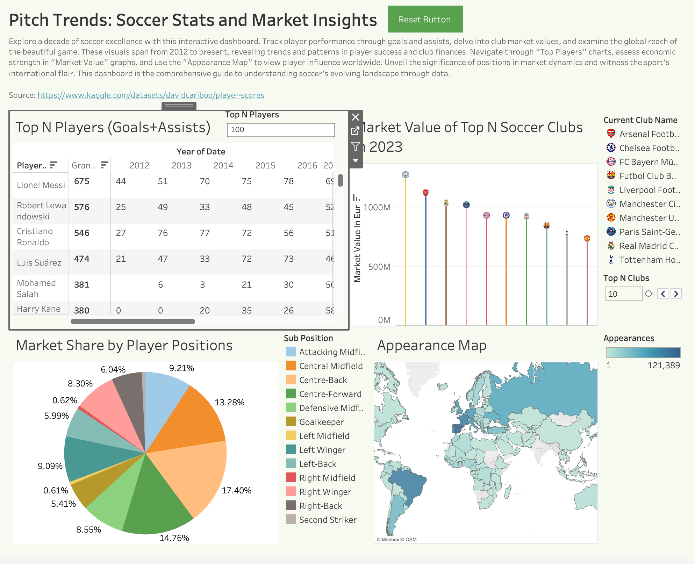

# Pitch Trends: Soccer Stats and Market Insights

## Project Overview
This project explores key soccer statistics and market trends using interactive Tableau dashboards. By analyzing player performance through goals and assists, club market values, and the global presence of top players, this project provides insights into soccer's evolving landscape over the past decade.

## About Me
Hi! I'm __Yash Gupta__, a graduate student at __Washington University in St. Louis, Olin Business School__, pursuing my __Master of Science in Business Analytics - Customer Analytics__. I have a strong passion for data-driven problem-solving and storytelling, with experience across data engineering, analytics, and marketing research in industries like real estate, environmental sustainability, and digital marketing.

With expertise in Python, SQL, R, Tableau, Azure, Databricks, Power BI, and more, I have worked on projects involving text mining, customer segmentation, market research, and database optimization. My goal is to deepen my knowledge of statistical and machine learning techniques while sharpening my ability to translate complex data insights into actionable business strategies.

I am interested in roles that focus on translating complex business problems into mathematically and statistically solvable frameworks and delivering __actionable insights__ that empower clients and stakeholders to maximize the value of their investment in data-driven decision-making.

## Installation & Usage
To explore the Tableau visualizations and data:
1. Clone this repository:
   ```sh
   git clone https://github.com/yourusername/soccer-stats-market-insights.git
   ```
2. Download the Tableau workbook from the following link:
   [Download Tableau File](https://drive.google.com/drive/folders/1pbRF7PkVF9KcjXc6dYdPdpYmLFJnMQF8?usp=sharing)
3. Open the downloaded Tableau workbook using Tableau.
4. Navigate through the different dashboards to explore trends and insights.

## Data and Insights
This study utilizes multiple datasets to explore key aspects of soccer trends. The primary areas of focus include:
- **Top Player Performance**: Tracking the top goal scorers and assist providers over the years.
- **Club Market Value Trends**: Understanding the financial worth of top soccer clubs.
- **Player Position Market Share**: Analyzing the distribution of positions in the soccer market.
- **Global Player Appearances**: Mapping the international influence of soccer players worldwide.

## Tableau Visualizations
The following Tableau dashboards were created to illustrate these findings:

### Soccer Stats & Market Insights Dashboard
<!-- -->

## License
This project is open-source and available for further exploration and enhancement.

---
